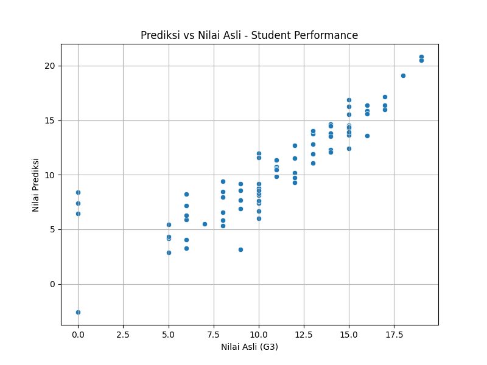

# 🎓 Student Performance Prediction

Tugas AI - Pengukuran Kinerja Model (Supervised Learning)  
Topik: Prediksi Nilai Akhir Siswa menggunakan Linear Regression

---

## 📌 Deskripsi Proyek
Proyek ini bertujuan untuk memprediksi **nilai akhir siswa (G3)** berdasarkan data akademik dan sosial seperti:
- Jam belajar (`studytime`)
- Absensi (`absences`)
- Status keluarga
- Kegiatan ekstrakurikuler, dan lainnya

Dengan prediksi ini, sekolah dapat **mengidentifikasi siswa berisiko** lebih awal dan memberikan dukungan belajar yang sesuai.

---

## 🧠 Jenis Masalah
- **Tipe:** Regresi
- **Target:** `G3` (nilai akhir siswa)

---

## 🗂️ Dataset
- Dataset: [UCI Student Performance Dataset](https://archive.ics.uci.edu/dataset/320/student+performance)
- File yang digunakan: `student-mat.csv`
- Jumlah data: 395 siswa
- Format: CSV (delimiter: `;`)

---

## 🧪 Model yang Digunakan
- **Linear Regression** dari `scikit-learn`

### 🔄 Tahapan Pemodelan:
1. Load dataset dan parsing data
2. Encoding fitur kategorikal (`get_dummies`)
3. Split data menjadi 80% training dan 20% testing
4. Latih model Linear Regression
5. Prediksi nilai akhir
6. Evaluasi hasil dengan RMSE

---

## 📊 Evaluasi Model

| Metrik Evaluasi | Nilai |
|-----------------|-------|
| RMSE            | 2.38  |

Visualisasi hasil prediksi:


Interpretasi:  
Sebagian besar prediksi mendekati nilai sebenarnya. Model cukup baik dalam menangani data menengah dan tinggi, dengan sedikit penyebaran pada nilai rendah.

## Instalasi

1. Clone repositori:
   ```bash
   git clone  https://github.com/mutimrd2n/EDA-OnlineRetail.git
   cd EDA-OlineRetail
   
2. Install dependencies :
   ```bash
   pip install -r requirements.txt

3. Menjalankan Program
   ```bash
   python eda_onlineretail.py
